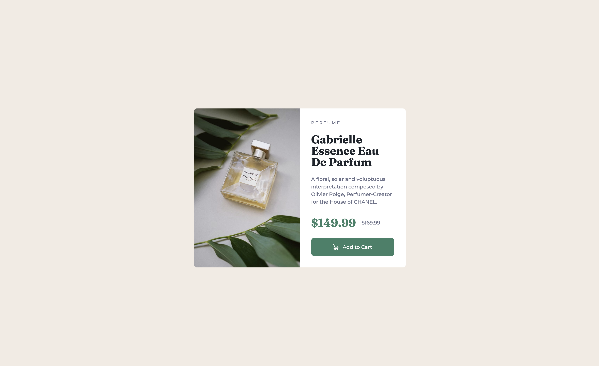

# Frontend Mentor - Product preview card component solution

This is a solution to the [Product preview card component challenge on Frontend Mentor](https://www.frontendmentor.io/challenges/product-preview-card-component-GO7UmttRfa).

## Table of contents

- [Overview](#overview)
  - [The challenge](#the-challenge)
  - [Screenshot](#screenshot)
  - [Links](#links)
- [My process](#my-process)
  - [Built with](#built-with)
  - [What I learned](#what-i-learned)
  - [Useful resources](#useful-resources)
- [Author](#author)

## Overview

### The challenge

Users should be able to:

- View the optimal layout depending on their device's screen size
- See hover and focus states for interactive elements

### Screenshot



### Links

- Solution URL: (https://www.frontendmentor.io/solutions/product-preview-card-component-challenge-omAvrtHTdI)
- Live Site URL: (https://gabbyhunter1.github.io/Product-Card-Component-Challenge/)

## My process

### Built with

- Semantic HTML5 markup
- CSS custom properties
- Flexbox
- CSS Grid
- Mobile-first workflow

### What I learned

I learnt a useful thing called <source> that helped me with changing the card picture depending on the viewport:

```html
<picture class="card__img">
  <source srcset="./images/image-product-desktop.jpg" media="(min-width: 600px)" />
  
</picture>
```

### Useful resources

- [A (more) Modern CSS Reset](https://piccalil.li/blog/a-more-modern-css-reset/) - That's my first CSS reset and I think I'll stick with it for some time.
- [Kevin Powell](https://www.youtube.com/@KevinPowell) - The best YT channel for learning CSS.

## Author

- Frontend Mentor - [gabbyhunter1](https://www.frontendmentor.io/profile/gabbyhunter1)
- Twitter - [@mjackson50\_](https://x.com/mjackson50_)
